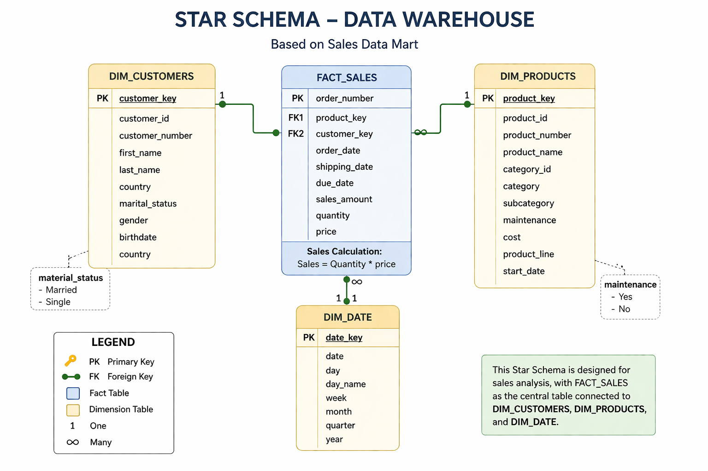

# 📊 SQL Data Warehouse & Business Insights Dashboard

## 🚀 Overview

This project demonstrates the design and implementation of a modern SQL-based Data Warehouse using ETL pipelines and Medallion Architecture (Bronze, Silver, Gold layers), along with an interactive Power BI Business Insights Dashboard for analytics and reporting.

The project transforms raw CRM & ERP data into business-ready insights for decision-making through dimensional modeling, Gold-layer analytical views, and interactive dashboards.

---

# 🧱 Data Architecture


## 🔹 Architecture Layers

- **Bronze Layer** → Raw data ingestion from CRM & ERP CSV files  
- **Silver Layer** → Data cleansing, transformation, and integration  
- **Gold Layer** → Business-ready analytical views optimized for reporting and dashboard consumption  

---

# 🔄 ETL Data Flow


## Process

1. Extract raw data from CSV files  
2. Load raw data into Bronze layer  
3. Transform and standardize data in Silver layer  
4. Build analytical views in Gold layer  
5. Connect Power BI dashboards to Gold-layer views  

---

# 🧩 Data Model (Star Schema)



## Tables

### Fact Table
- Fact_Sales

### Dimension Tables
- Dim_Customer
- Dim_Product
- Dim_Date

---

# 📈 Business Insights Dashboard

The Power BI dashboard connects directly to Gold-layer analytical SQL views and provides interactive business reporting across multiple pages.

---

## 🏢 Executive Overview


### Highlights
- Revenue KPIs
- Monthly sales trends
- Top-performing products
- Revenue by country
- Product category insights

---

## 👥 Customer Analysis


### Highlights
- Customer demographics
- Revenue by marital status
- Customers by age group
- Top customers by revenue
- Customer geographic distribution

---

## 📦 Product Performance


### Highlights
- Product quantity sold
- Revenue & profit analysis
- Sub-category performance
- Product-level insights
- Interactive slicers and navigation

---

# 📊 DAX Measures & Calculated Columns

## Measures Used

### Revenue & Profit Measures
- Total Revenue
- Total Profit
- Profit Margin %

### Sales & Order Measures
- Total Orders
- Total Quantity
- Average Order Value

### Customer Measures
- Total Customers
- Countries Served

---

## Calculated Columns

### Customer Analysis
- Age
- Age Group
- Age Sort

---

## Dashboard Features Powered by DAX

- KPI Reporting
- Profitability Analysis
- Customer Demographics
- Revenue Trends
- Product Performance Analysis
- Interactive Filtering & Slicers

---

# 🛠️ Tech Stack

- SQL Server
- T-SQL
- Power BI
- DAX
- Data Warehousing
- ETL Pipelines
- Star Schema Modeling

---

# ✨ Key Features

- Medallion Architecture (Bronze, Silver, Gold)
- ETL data processing pipeline
- Gold-layer analytical SQL views
- Interactive multi-page Power BI dashboard
- KPI reporting & business analytics
- Dynamic slicers and page navigation
- DAX measures and calculated columns

---

# 📂 Project Structure

```
📦 sql-data-warehouse-project
┣ 📂 datasets
┣ 📂 scripts
┃ ┣ 📂 bronze
┃ ┣ 📂 silver
┃ ┗ 📂 gold
┣ 📂 docs
┃ ┣ 📄 data_architecture.png
┃ ┣ 📄 ETL_flow.png
┃ ┗ 📄 star_schema.png
┣ 📂 analytics
┃ ┣ 📄 Business_insights_dashboard.pbix
┃ ┗ 📂 dashboard_screenshots
┃   ┣ 📄 Executive_overview.png
┃   ┣ 📄 Customer_overview.png
┃   ┗ 📄 Product_overview.png
┣ 📄 README.md
# 📈 Sample Business Insights
-----
- Identified top-performing products and sub-categories contributing to overall revenue
- Analyzed monthly revenue trends and sales performance across regions
- Performed customer demographic analysis using age groups and marital status
- Evaluated product profitability and quantity sold across categories
- Built interactive dashboards for customer, sales, and product analytics

# 🧠 Key Learnings

- Designed and implemented Medallion Architecture
- Built ETL pipelines using SQL Server and T-SQL
- Developed Gold-layer analytical views for reporting
- Implemented Star Schema modeling for business analytics
- Created interactive Power BI dashboards with DAX measures and calculated columns
- Developed multi-page analytical reports with slicers and navigation
- Transformed raw business data into actionable insights

---

# 📌 Future Improvements

- Automate ETL workflows and scheduled refresh pipelines
- Deploy dashboards to Power BI Service for cloud reporting
- Implement incremental data loading for scalability
- Add advanced analytics and forecasting features
- Optimize SQL query performance and indexing strategies

---

# 🤝 Connect With Me

I’m actively looking for opportunities in:

- Data Analytics
- Business Intelligence
- Data Operations

Feel free to connect with me on LinkedIn!

