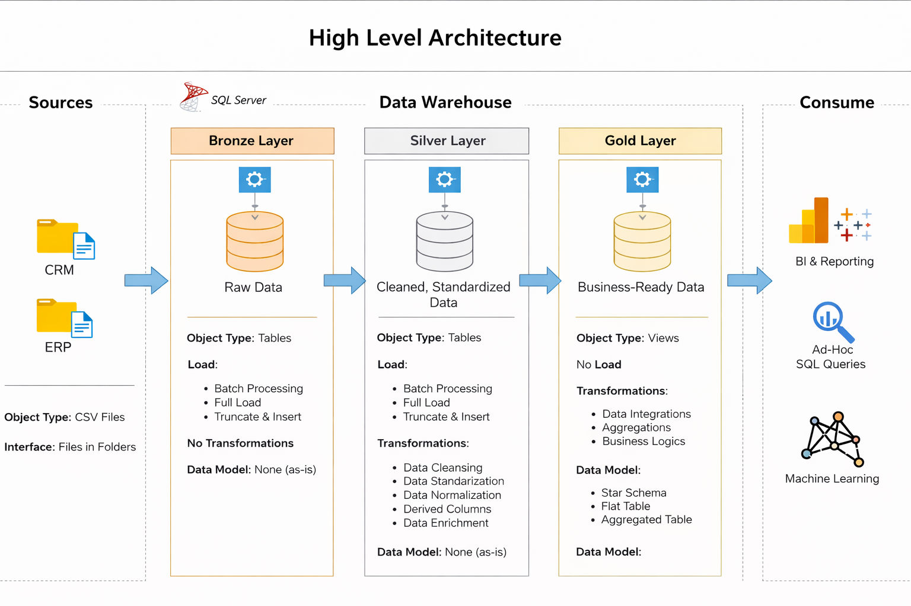
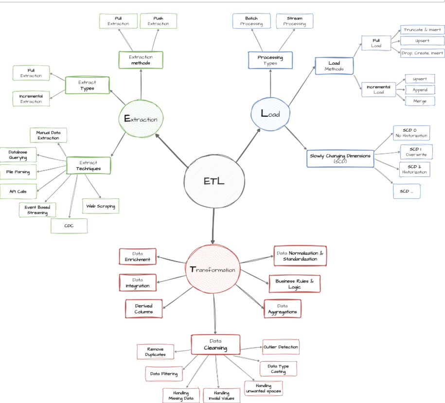

# 📊 SQL Data Warehouse Project (Medallion Architecture)

## 🚀 Overview
This project demonstrates the design and implementation of a modern SQL-based data warehouse using ETL pipelines and Medallion Architecture (Bronze, Silver, Gold layers).

The goal is to transform raw data into meaningful insights for business decision-making.

---

## 🧱 Data Architecture

### 🔹 Architecture Layers:
- **Bronze Layer** → Raw data ingestion from CRM & ERP (CSV files)
- **Silver Layer** → Data cleaning, transformation, and integration
- **Gold Layer** → Business-ready data modeled into fact & dimension tables

---

## 🔄 ETL Data Flow

### Process:
1. Extract data from CSV files
2. Load into staging (Bronze)
3. Transform and clean (Silver)
4. Load into warehouse (Gold)
5. Query for analytics

---

## 🧩 Data Model (Star Schema)

### Tables:
- **Fact Table:** Fact_Sales  
- **Dimension Tables:** Dim_Customer, Dim_Product, Dim_Date  

---

## 🛠️ Tech Stack
- SQL Server
- T-SQL
- Data Warehousing Concepts
- ETL Pipelines

---

## 📂 Project Structure
📦 sql-data-warehouse-project
┣ 📂 datasets
┣ 📂 scripts
┃ ┣ bronze
┃ ┣ silver
┃ ┗ gold
┣ 📂 docs
┃ ┣ data_architecture.png
┃ ┣ data_flow.png
┃ ┗ star_schema.png
┣ README.md

---

## 📈 Sample Insights

- Top-selling products
- Monthly revenue trends
- Customer segmentation

---

## 🧠 Key Learnings

- Designed Medallion Architecture (Bronze, Silver, Gold)
- Built ETL pipelines using SQL
- Implemented Star Schema for analytics
- Wrote optimized SQL queries for insights

---

## 📌 Future Improvements

- Add dashboard (Power BI / Tableau)
- Automate ETL pipeline
- Add indexing for performance optimization

---

## 🤝 Connect With Me

I’m actively looking for Data Analyst / Data Operations roles.

Feel free to connect on LinkedIn!
